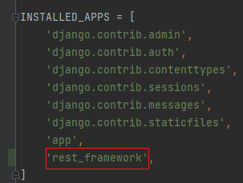
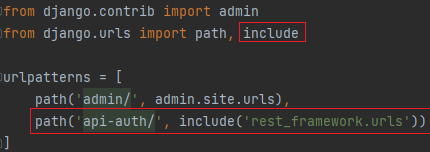

## Общее

Работа будет построена на составлении 


Для работы rest_framework должен быть объявлен в settings.py в INSTALLED_APPS
```python
INSTALLED_APPS = [
    ...
    'rest_framework',
]
```


Если вы собираетесь использовать доступный для просмотра API, вы, вероятно, также захотите добавить представления входа 
в систему и выхода из системы REST. Добавьте следующее в корневой urls.py файл. 

```python
urlpatterns = [
    ...
    path('api-auth/', include('rest_framework.urls', namespace='rest_framework'))
]
```



Про настройку словаря REST_FRAMEWORK (задаваемом в settings.py) можно почитать в файле `settings.md`

Общая последовательность при создании точки входа состоит из следующих частей:
* `Создание сериализатора`. Сериализаторы позволяют преобразовывать сложные данные, такие как наборы запросов и экземпляры моделей, 
в собственные типы данных Python, которые затем могут быть легко преобразованы в JSON, XML или другие типы содержимого. 
Сериализаторы также обеспечивают десериализацию, позволяя преобразовывать разобранные данные обратно в сложные типы после 
предварительной проверки входящих данных.
* `Создание представления`.
* `Создание точки подключения к API`.

## Сериализатор

Сериализаторы можно создать в любом удобном месте в коде вашего проекта, но есть ещё подход отнести под них отдельный
определенный файл такой как `serializers.py` что и будет сделано в приложении `app`.

Сериализатор создаётся как класс наследующийся от базового класса. 

Под базовым классом чаще всего бывает:

* `BaseSerializer` - Является базовым абстрактным классом, от которого наследуются другие сериализаторы в DRF.
Этот класс предоставляет основные функциональные возможности для сериализации и десериализации данных, но он не предоставляет 
никакой конкретной реализации для различных типов данных или моделей. Может понадобиться в случае необходимости 
создание своего типа сериализатора. 


* `Serializer` - Является основным классом сериализатора в DRF. Он предоставляет мощные функциональные возможности для 
сериализации и десериализации различных типов данных, включая словари, списки, модели Django и другие.
Serializer используется для создания сериализаторов, которые могут преобразовывать сложные структуры данных в форматы JSON 
или другие форматы для передачи через API.
Этот класс обычно используется для сериализации единичных объектов или сложных структур данных.


* `ListSerializer` - Является специальным классом сериализатора, который предоставляет дополнительные возможности для сериализации списков объектов.
Этот класс позволяет определить особое поведение для сериализации списка объектов, когда вам нужно производить дополнительные манипуляции с каждым объектом списка.
ListSerializer используется для сериализации списков объектов и может быть полезен, когда вам нужно контролировать сериализацию 
элементов списка или добавить дополнительные данные к каждому объекту.


* `ModelSerializer` - Предоставляет простой и удобный способ автоматической сериализации и десериализации моделей Django.
Он обрабатывает все поля модели, включая внешние ключи и связи многие-к-одному или многие-ко-многим.
С помощью ModelSerializer вы можете легко создавать API для вашей модели, которое позволяет выполнять операции CRUD 
(создание, чтение, обновление, удаление) с данными модели.
Кроме того, ModelSerializer автоматически создает валидаторы, основанные на вашей модели, и обрабатывает валидацию данных при десериализации.


* `HyperlinkedModelSerializer` - предоставляет те же функциональные возможности, что и ModelSerializer, но с 
добавленным функционалом гиперссылок (URL-ссылок) для связанных моделей.
Когда используется HyperlinkedModelSerializer, связанные модели представляются в виде URL-ссылок, а не как простые идентификаторы (Primary Keys). 
Это делает представление данных более удобным и навигируемым для клиентов.
При использовании HyperlinkedModelSerializer, клиенты могут получить доступ к связанным объектам, следуя гиперссылкам, 
что упрощает навигацию и обмен данными между различными частями вашего API.
Для работы с HyperlinkedModelSerializer необходимо настроить URL-маршруты для представления гиперссылок.


Базовые классы находятся в `rest_framework.serializers`
```python
from rest_framework.serializers import BaseSerializer, Serializer, \
    ListSerializer, ModelSerializer, HyperlinkedModelSerializer
```

Код сериализаторов можно посмотреть по пути `venv\Lib\site-packages\rest_framework\serializers.py`

Ниже рассмотрим пару примеров создания сериализаторов.


