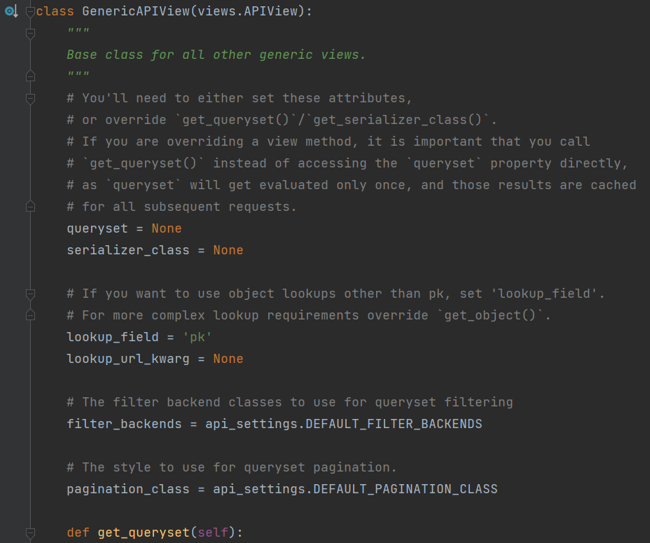

Код представлений можно посмотреть по пути `venv\Lib\site-packages\rest_framework\generics.py`

`GenericAPIView` позволяют упростить часть повторяющихся задач, чтобы в итоге кода было меньше и не было необходимости
так объёмно описывать обработчик как при `APIView`.

