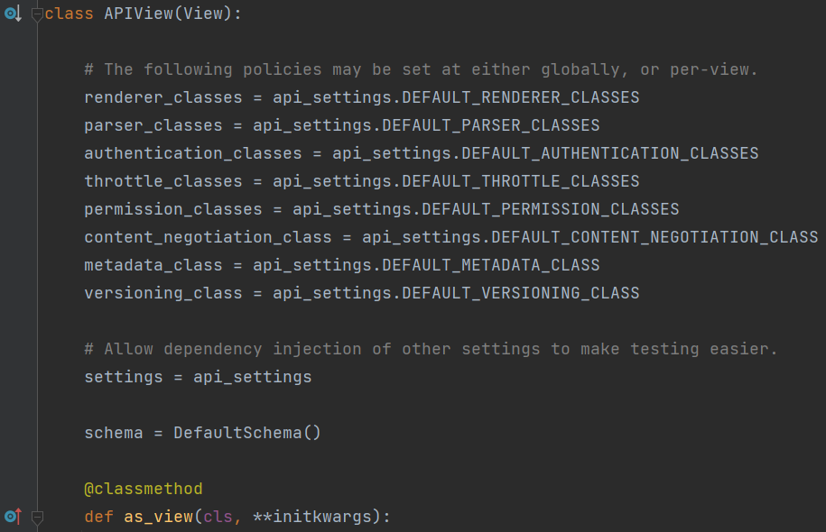
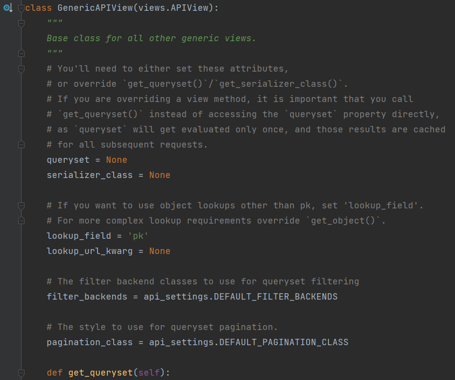

Код представлений можно посмотреть по пути `venv\Lib\site-packages\rest_framework\views.py`

Код представлений можно посмотреть по пути `venv\Lib\site-packages\rest_framework\generics.py`

DRF предоставляет 4 различных типа представлений для работы с данными:

* `APIView`: Это базовый класс представления, который предоставляет полный контроль 
над логикой обработки запросов и формирования ответов. Вы определяете методы для 
каждого HTTP-метода (например, get, post, put, delete) и обрабатываете данные вручную.


* `GenericAPIView`: Этот класс предоставляет базовую логику для обработки различных 
операций, таких как получение списка объектов, создание объекта, обновление объекта 
и удаление объекта. Вы используете классы-миксины (например, 
ListAPIView, CreateAPIView, RetrieveUpdateDestroyAPIView), чтобы определить 
конкретное поведение.


* `ViewSets`: ViewSets предоставляют более декларативный способ определения 
различных операций на объектах. Вы определяете методы, такие как 
list, create, retrieve, update, partial_update и destroy, и DRF автоматически 
маршрутизирует запросы на соответствующие методы. Возможно использование декораторов, 
чтобы настроить поведение.


* `ModelViewSet`: Это расширение ViewSets, которое автоматически предоставляет 
стандартные операции CRUD (create, retrieve, update, destroy) для модели. 
Он связывает представления с конкретной моделью, позволяя обрабатывать запросы 
с минимальным кодом.

## APIView

APIView представляет собой низкоуровневую абстракцию которую удобно использовать 
когда:

* Нужно полное управление над обработкой запросов и ответов.
* Хотите более гибко настраивать логику для конкретных HTTP-методов.
* Логика обработки запросов сложнее стандартных CRUD-операций.


Класс APIView наследуется от View класса представления Django(на картинке 
представлена часть исходного кода)



Внутри обладает классовыми атрибутами, которые ранее описывались в `settings.md`,
соответственно для каждого представления можно переопределить ряд настроек или
по умолчанию они будут загружаться из словаря `REST_FRAMEWORK` (задаваемом в `settings.py`):

* `renderer_classes` = api_settings.DEFAULT_RENDERER_CLASSES. 
Определяет классы рендеринга (отображения) контента


* `parser_classes` = api_settings.DEFAULT_PARSER_CLASSES. 
Определяет классы парсера, используемые для разбора входящего запроса.


* `authentication_classes` = api_settings.DEFAULT_AUTHENTICATION_CLASSES. 
Определяет классы аутентификации, используемые для проверки подлинности пользователя.


* `throttle_classes` = api_settings.DEFAULT_THROTTLE_CLASSES.
Определяет классы ограничения скорости (throttle), которые контролируют частоту 
запросов от клиентов


* `permission_classes` = api_settings.DEFAULT_PERMISSION_CLASSES.
Определяет классы разрешений, используемые для определения доступа к ресурсам API.


* `content_negotiation_class` = api_settings.DEFAULT_CONTENT_NEGOTIATION_CLASS.
Определяет класс для выбора контента на основе заголовков запроса.


* `metadata_class` = api_settings.DEFAULT_METADATA_CLASS. 
Определяет класс метаданных, используемый для генерации метаданных API.


* `versioning_class` = api_settings.DEFAULT_VERSIONING_CLASS.
Определяет класс версионирования, используемый для управления версиями API.

Простейшее представление выглядит следующим образом. Аналогично по описанию с
представлением Django

```python
from rest_framework.views import APIView
from rest_framework.response import Response


class MyView(APIView):
    def get(self, request):
        data = {'message': 'Hello from MyView!'}
        return Response(data)
```
 Для полноценной проверки нужно будет зарегистрировать url, запустить сервер и проверить. 
 Однако можно пойти другим путём и провести проверку без запуска сервера и регистрации,
правда данным путём не получится проверить все тонкости если это касается специфики вашего API.

Для проверки воспользуемся `APIRequestFactory` из `rest_framework.test` он аналогичен
`RequestFactory` из `django.test`, только оптимизирован для работы с объектами DRF.

```python
from rest_framework.views import APIView
from rest_framework.response import Response
from rest_framework.test import APIRequestFactory


class MyView(APIView):
    def get(self, request):
        data = {'message': 'Hello from MyView!'}
        return Response(data)


# Создаем объект RequestFactory
factory = APIRequestFactory()

# Создаем экземпляр представления
view = MyView.as_view()

# Создаем объект get запроса
request = factory.get('/my-view/')

# Вызываем представление и получаем ответ
response = view(request)

# Проверяем результат
print(response.data)  # {'message': 'Hello from MyView!'}
```
Аналогично можно создать запросы для post, put, delete

```python
from rest_framework.views import APIView
from rest_framework.response import Response
from rest_framework.test import APIRequestFactory
from rest_framework import status  # Импортируем статусы HTTP

class MyView(APIView):
    def get(self, request):
        data = {'message': 'Hello, World!'}
        return Response(data)

    def post(self, request):
        data = {'message': 'POST request received'}
        return Response(data, status=status.HTTP_201_CREATED)

    def put(self, request):
        data = {'message': 'PUT request received'}
        return Response(data)

    def delete(self, request):
        data = {'message': 'DELETE request received'}
        return Response(data, status=status.HTTP_204_NO_CONTENT)


# Создаем объект RequestFactory
factory = APIRequestFactory()

# Создаем экземпляр представления
view = MyView.as_view()

# Создаем объект get запроса
request = factory.get('/my-view/')
response = view(request)
print(response.data)  # {'message': 'Hello from MyView!'}

# Создаем объект post запроса
request = factory.post('/my-view/')
response = view(request)
print(response.data)  # {'message': 'POST request received'}

# Создаем объект put запроса
request = factory.put('/my-view/')
response = view(request)
print(response.data)  # {'message': 'PUT request received'}

# Создаем объект delete запроса
request = factory.delete('/my-view/')
response = view(request)
print(response.data)  # {'message': 'DELETE request received'}
```

При работе с APIView нет встроенного механизма для работы с сериализаторами, поэтому
работу с сериализаторами необходимо прописывать самостоятельно. Сериализатор можно использовать
любой что был написан ранее хоть с использованием Serializer или ModelSerializer и т.д.

Для примера рассмотрим пример использования сериализатора API, позволяющего 
получить все записи блогов на базе Serializer 

```python

```


## GenericAPIView



